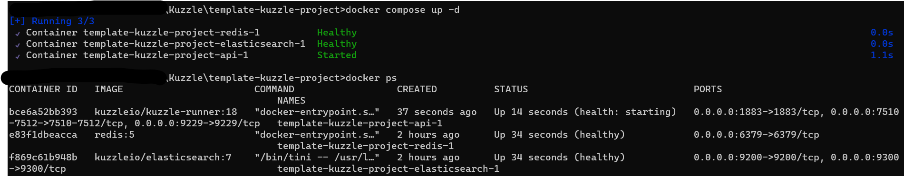
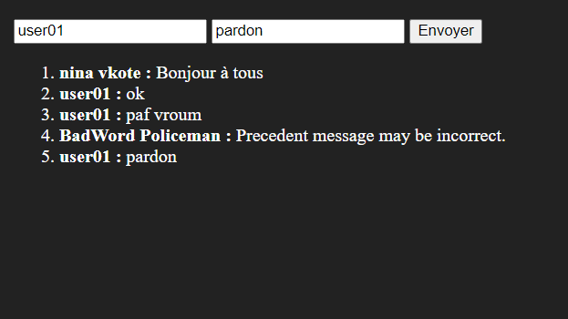

# Kuzzle test

## Exercice 1 :

Après l'installation de kourou (`npm install kourou -g`)  
  
Suite à ce problème je récupère directement le dépot concerné.

Après avoir cloné le dépôt : `template-kuzzle-project`  
Docker compose lèvent les trois conteneurs.  
  

N'ayant pas réussi à installer Kuzzle grâce à Kourou, il m'est compliqué de faire un retour détaillé sur la DX.
En revanche, malgré quelques complications liées au lancement de la template avec composer le service backend fonctionne parfaitement.
Les instructions sur les dépôts sont suffisantes pour pouvoir utiliser directement les sources.

## Exercice 2 :

Connection à l'instance kuzzle :
```js
await kuzzle.connect();
```

Création d'une collection :
```js
await kuzzle.collection.create('chat', 'chat-messages', { mappings });
```

Souscription aux événements de la collection :
```js
const filters = { exists: 'author' };

await kuzzle.realtime.subscribe('chat', 'chat-messages', filters, chatMessages);
await kuzzle.document.create('chat', 'chat-messages', msg);
```

L'objet retourné est de la forme :
```json
{
	"type": "document",
	"status": 200,
	"action": "create",
	"scope": "in",
	"result": {
		"_id": "AB7ADI0ButuIpPRqve5_",
		"_source": {
			"author": "nina vkote",
			"message": "Bonjour à tous",
			"_kuzzle_info": {
				"author": "-1",
				"createdAt": 1705315974526,
				"updatedAt": null,
				"updater": null
			}
		},
		"_version": 1
	},
	"node": "knode-adorable-weasel-112",
	"event": "write",
	"requestId": "cb88ef48-a23d-4562-83cf-760fb8678328",
	"timestamp": 1705315974524,
	"volatile": {
		"sdkInstanceId": "3c487c63-85c1-49ec-ba31-24dfa502bcf0",
		"sdkName": "js@7.11.2"
	},
	"index": "chat",
	"collection": "chat-messages",
	"controller": "document",
	"protocol": "websocket",
	"room": "d6ad7d9ec65d8d76298dc3cf9101ca2c48cd27c100060f695feed508ede32af1-311"
}
```

## Exercice 3 :

Grâce à la fonction d'usage pour l'envoi des messages, on peut vérifier la présence d'un auteur et la taille du contenu. 
```js
async function sendMessage(author, message)
{
	if(!author) return;
	message.substring(0, 255);

	await kuzzle.document.create('chat', 'chat-messages',
		{ author: author, message: message });
}
```

Ensuite, avec une simple application Vue.js, il est possible d'écrire et d'envoyer des messages.  
```js
const app = new Vue({
	el: '#app',
	data: {
		author: 'user01',
		messageToSend: '',
		messages: sessionMessages
	},
	methods: {
		send: async function () {
			await sendMessage(this.author, this.messageToSend);
		}
	}
});
```

## Bonus :

Enfin, avec les fonctionnalités *realtime* il est possible de réagir en temps réel aux messages des utilisateurs grâce à un client spécialisé.  

```js
const badWordsClient = new KuzzleSDK.Kuzzle(
	new KuzzleSDK.WebSocket('localhost', { port: 7512 })
);

const badWords = [ 'miam', 'paf', 'vroum' ];

function badWordsBehave(notification)
{
	for(word of badWords)
	{
		if(notification.result._source.message.includes(word))
		{
			sendMessage('BadWord Policeman', 'Precedent message may be incorrect.');
			break;
		}
	}
}

...

await badWordsClient.connect();
await badWordsClient.realtime.subscribe('chat', 'chat-messages', filters, badWordsBehave);

```

### Exemple :

 